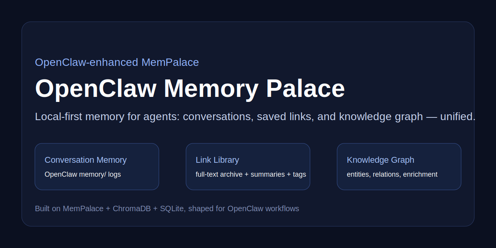

<div align="center">



# OpenClaw Memory Palace

### An OpenClaw-enhanced MemPalace: unified conversation memory + link library + knowledge graph — local-first.

[English](README.md) · [🇨🇳 中文](README.zh-CN.md)

[](https://github.com/Nowhitestar/openclaw-memory-palace/releases)
[](./LICENSE)
[](https://github.com/openclaw/openclaw)
[](https://github.com/milla-jovovich/mempalace)

<br>

[Quick Start](#quick-start) · [Why This Exists](#why-this-exists) · [What Users Experience](#what-users-experience) · [Architecture](#architecture) · [FAQ](docs/FAQ.md)

</div>

---

Every serious agent workflow creates memory:
- why a decision was made
- which link mattered
- what tradeoff was discussed
- what changed over time

But in most setups, that memory is fragmented:
- conversation logs live in one place
- saved links live in another
- semantic retrieval is weak or missing
- entity relationships are never made explicit

**OpenClaw Memory Palace** turns MemPalace into an **OpenClaw-native memory layer**.
It gives OpenClaw a single local-first system for:
- conversation memory
- saved links / reading archive
- semantic retrieval over long content
- lightweight knowledge graph enrichment

The important framing: **users should mostly interact with OpenClaw, not with `mp` directly.**
`mp` is the integration layer under the hood.


## Quick Start

### Option A (recommended): clone & run

```bash
git clone https://github.com/Nowhitestar/openclaw-memory-palace.git
cd openclaw-memory-palace
bash install.sh
```

### Option B: one-liner (review before you run)

```bash
curl -fsSL https://raw.githubusercontent.com/Nowhitestar/openclaw-memory-palace/main/install.sh | bash
```

If `mp` is not found afterwards, add this to your shell profile:

```bash
export PATH="$HOME/.local/bin:$(python3 -m site --user-base)/bin:$PATH"
```

### Verify the install

```bash
mp status
```

That is mostly for setup/inspection. In normal use, OpenClaw should call the memory layer for the user.


## Why This Exists

MemPalace is an excellent memory engine.
But OpenClaw needs a product layer around it:

- a place to store **full original source text**
- a workflow for **saving links** from real conversations
- retrieval that works well on **long articles and threads**
- a memory system shaped around how **agents** actually work

That is what this project does.

It is not just “MemPalace + a wrapper”.
It is an OpenClaw-shaped memory stack built on top of MemPalace.


## What Users Experience

A normal user experience should look like this:

1. You chat with OpenClaw normally.
2. You share a link, ask it to remember something, or later ask “what did we decide before?”
3. OpenClaw stores or retrieves the relevant memory behind the scenes.
4. You get better continuity — without manually operating the storage system.

Examples of user-facing moments:
- “Summarize this link and keep it for later.”
- “Find that article I saved about agent memory.”
- “Why did we switch approaches?”
- “What did we decide last month about auth?”

See also: [`examples/user-flow.md`](examples/user-flow.md)


## What You Get

### 1) One unified memory surface
- **Conversation memory** from OpenClaw logs
- **Saved link library** in OpenClaw `library/`
- **Knowledge graph** for entities and relations

### 2) Full original text stays readable
Saved links are archived as markdown files, with:
- full original text
- summary
- tags
- related entries

### 3) Retrieval is optimized for agent work
Long documents are indexed as overlapping chunks in MemPalace / ChromaDB for better semantic recall.

### 4) Local-first by default
- your files stay local
- your vector store stays local
- your graph stays local


## Advanced / Operator Commands

Most end users should not need these day to day.
They exist for installation, debugging, and power-user workflows.

```bash
mp status
mp search "why did we choose X"
mp find "agent workflow"
mp save <url>
mp graph enrich
mp graph query <entity>
mp list
```


## Architecture

```text
User
  │
  │ normal conversation / sharing links / asking about the past
  ▼
OpenClaw agent
  │
  ├─ recalls memory when needed
  ├─ saves interesting links when appropriate
  └─ queries related entities / decisions
  ▼
mp (internal integration layer)
  │
  ├─ library files (source of truth)
  ├─ MemPalace / ChromaDB (semantic retrieval)
  └─ SQLite knowledge graph (entities + relations)
```

More detail: [`docs/ARCHITECTURE.md`](docs/ARCHITECTURE.md)

### Storage layout

**Source of truth (files):**
- `~/.openclaw/workspace-main/library/`

**Semantic index (vectors):**
- `~/.mempalace/palace`
- documents are indexed as overlapping chunks

**Knowledge graph (SQLite):**
- `~/.mempalace/knowledge_graph.sqlite3`


## What’s Different from Vanilla MemPalace?

MemPalace is the engine.
This repo is the OpenClaw-focused memory product layer on top of it.

- ✅ turns the old Link Library idea into a MemPalace-backed workflow
- ✅ stores full source text in OpenClaw’s `library/`
- ✅ indexes long content in chunks for retrieval
- ✅ adds graph enrichment from saved library metadata
- ✅ keeps the whole system local-first and human-readable


## Repo contents

```text
assets/banner.svg
bin/mp.py
install.sh
upgrade.sh
uninstall.sh
README.md
README.zh-CN.md
docs/ARCHITECTURE.md
docs/FAQ.md
docs/OPENCLAW_INTEGRATION.md
docs/RELEASE_NOTES_v0.1.0.md
examples/quickstart.md
examples/demo-output.txt
examples/user-flow.md
```


## Safety / Privacy

- This repo does **not** upload your personal memory.
- It ships reusable code + scripts only.
- Your local data remains on your machine.


## Upgrade / Uninstall

```bash
bash upgrade.sh
bash uninstall.sh
```


## Credits

Built on top of MemPalace by Milla Jovovich & Ben Sigman.


## License

MIT
